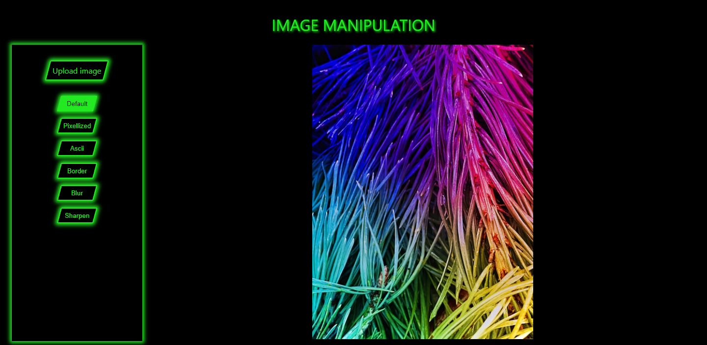
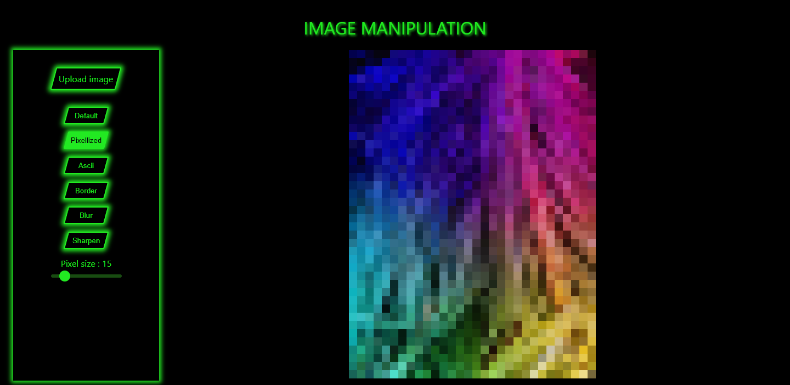
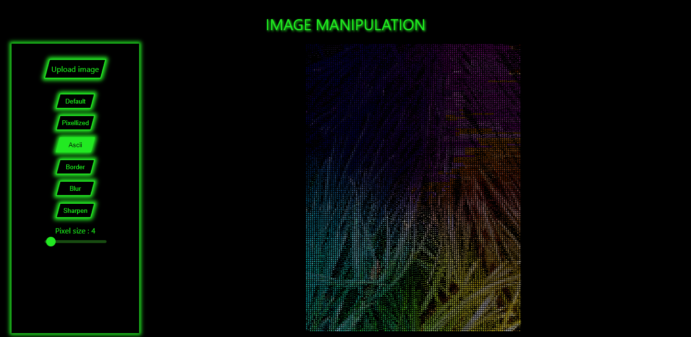
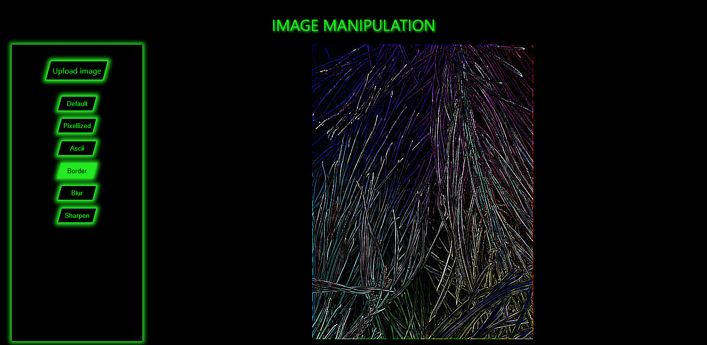
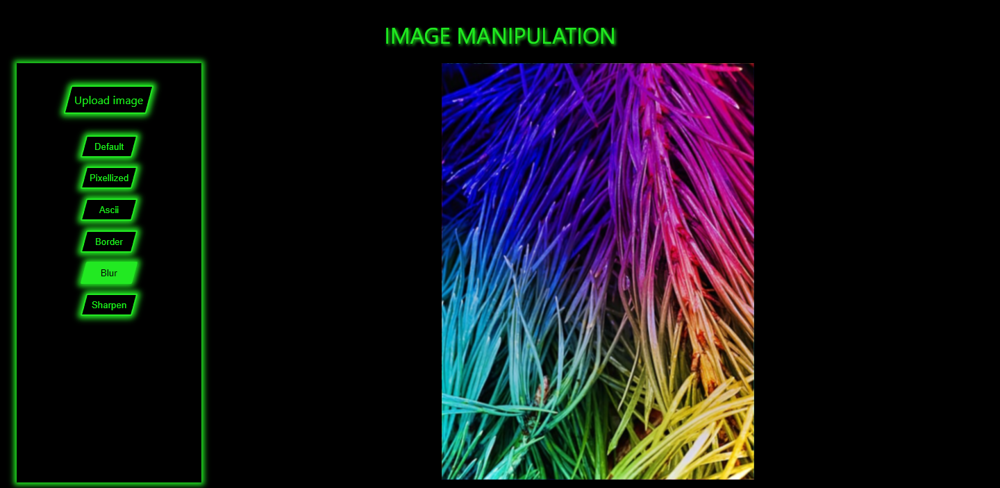
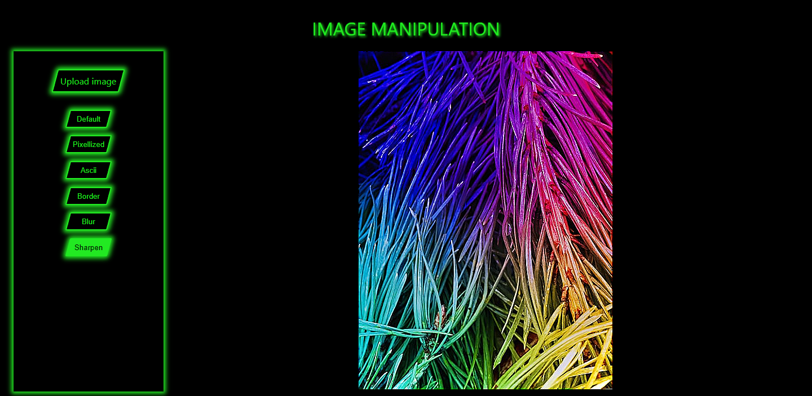

# ImageManipulation

Image Manipulation is a project I did for fun where I work with images and pixels.  
I built it using Svelte to discover and train with this framework. I also used Vite for the first time for very fast server availablity and HMR.

**Technos used :** Docker, Vite, Svelte, TS

## Implemented filters

### Pixelate

The image is pixelated by averaging the color between pixels.  
The pixel size of the end image compared to the original can be selected with a slider.  

### Ascii

The image is pixelated in the same way as in the pixelated filter.   
Then, every pixel is assigned an ASCII character based on the "color density" of the pixel, the value component in HSV.  
The characters are then printed with the corresponding colors.

### Border

A border filter is applied by computing a convolution product with the image on every color separately.  
This filter corresponds roughly to a second derivative and is computed with a 3*3 matrix.

### Blur

The blur filter is also applied using a convolution product.  
The blur effect is done by averaging the color of a pixel with the colors of its neighbours.  
The matrix used is 3*3 in size, thus explaining why the effect is very subtle.

### Sharpen

The sharpen filter is also applied using a convolution product.  
The matrix used is 3*3 in size, thus explaining why the effect is very subtle.

## Commands

Init project : `docker compose run init`  
Run project : `docker compose up -d --build app`  
Accessing the project : [127.0.0.1:3000](http://127.0.0.1:3000)

The 'init' docker is helpful for starting the project, when all the required files have not yet been created. It allowed me to launch the `npm create vite` command.

## Things that can be improved / done

- UI
- Code splitting
- Add more filters
- Image export